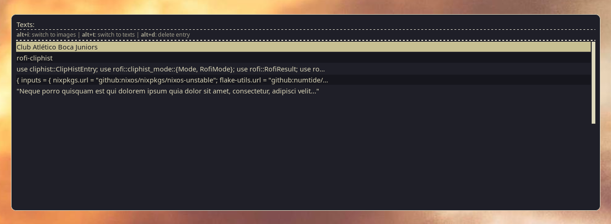
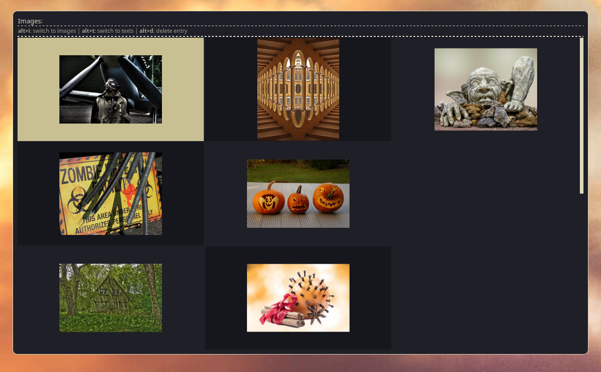

# Rofi Tools


[](https://github.com/pre-commit/pre-commit)


Note: Only tested with [rofi-wayland](https://github.com/lbonn/rofi), although
it should work with the [official version](https://github.com/davatorium/rofi).

## Installation

### Nix

#### Option 1: Using flakes (recommended)

If you have flakes enabled:

```bash
# Install directly
nix profile install github:szaffarano/rofi-tools

# Or run without installing
nix run github:szaffarano/rofi-tools
```

#### Option 2: Add to your NixOS configuration

Add to your `configuration.nix`:

```nix
{
  inputs.rofi-tools.url = "github:szaffarano/rofi-tools";

  outputs = { nixpkgs, rofi-tools, ... }: {
    # Your existing config...

    environment.systemPackages = with pkgs; [
      # Your other packages...
      rofi-tools.packages.${system}.default
    ];
  };
}
```

### Arch Linux

You can install this project using an [unofficial AUR
package](https://aur.archlinux.org/packages/rofi-tools-bin) (Thanks
[@a-priestley](https://github.com/a-priestley)):

```bash
yay -S rofi-tools
```

Alternatively, you can build from the AUR manually:

```bash
git clone https://aur.archlinux.org/rofi-tools-bin.git
cd rofi-tools-bin
makepkg -si
```

### Build from Source

If your distribution isn't listed above, you can build from source:

```bash
# Install Rust (if not already installed)
curl --proto '=https' --tlsv1.2 -sSf https://sh.rustup.rs | sh
source $HOME/.cargo/env

# Clone the repository
git clone https://github.com/szaffarano/rofi-tools.git
cd rofi-tools

# Build and install
cargo install --path .
```

Requirements:

- Rust 1.70 or newer
- [rofi](https://github.com/davatorium/rofi) or
  [rofi-wayland](https://github.com/lbonn/rofi) installed on your system
- [wl-clipboard](https://github.com/bugaevc/wl-clipboard)
- [cliphist](https://github.com/sentriz/cliphist)

## Cliphist integration

A WIP integration with `cliphist` to show both text and images in a Rofi menu.
Requires [wl-clipboard](https://github.com/bugaevc/wl-clipboard) and of course
[cliphist](https://github.com/sentriz/cliphist).

Since I wanted to use different layouts/rofi configurations for texts and
images, neither the `script` mode nor a custom mode/plugin were valid options
because it's impossible to dynamically update the layout without re-launching
Rofi (more [info here](https://github.com/davatorium/rofi/issues/1356)).

### Usage

Just build the tool or download the [latest
release](https://github.com/szaffarano/rofi-tools/releases) and add the binary
to your path.

It's also exposed as a Nix flake. Add the input to your `flake.nix`

```nix
{
  inputs = {
    rofi-tools = {
      url = "github:szaffarano/rofi-tools";
      inputs = {
        nixpkgs.follows = "nixpkgs";
      };
    };
  }
}
```

And reference the package as usual, e.g.,

```nix
home.packages = [
  inputs.rofi-tools.packages.${pkgs.system}.rofi-cliphist
];
```

And finally call it

```bash
rofi-cliphist
```

It will show by default all non-binary cliphist entries. You can switch between
text/image mode by using `Alt-t` / `Alt-i` and also delete entries using
`Alt-d`, `Alt-p` (delete previous) and `Alt-n` (delete next).





### Configuration

- Through the command line:

```bash
Usage: rofi-cliphist [OPTIONS]

Options:
  -v, --verbose                          Show verbose output
  -r, --rofi-path <ROFI_PATH>            Path to rofi executable [default: rofi]
  -c, --cliphist-path <CLIPHIST_PATH>    Path to cliphist executable [default: cliphist]
  -w, --clipboard-path <CLIPBOARD_PATH>  Path to wl-copy executable [default: wl-copy]
  -f, --config <FILE>                    Sets a custom config file
  -h, --help                             Print help
  -V, --version                          Print version
```

- Through a configuration file, either on `$XDG_CONFIG_HOME/rofi-cliphist.toml`
or the path specified using the `-f/--config` flag

```toml
[rofi]
path = "rofi"

[cliphist]
path = "cliphist"

[clipboard]
path = "wl-copy"

[text_mode_config]
title = "Text"
shortcut = "Alt+t"
description = "Switch to text mode"

[image_mode_config]
title = "Image"
shortcut = "Alt+i"
description = "Switch to image mode!"

[delete_mode_config]
title = "Delete"
shortcut = "Alt+d"
description = "Delete entry"

[delete_previous_config]
title = "Delete previous"
shortcut = "Alt+p"
description = "Delete all entries before the selected one"

[delete_next_config]
title = "Delete next"
shortcut = "Alt+n"
description = "Delete all entries after the selected one"
```
